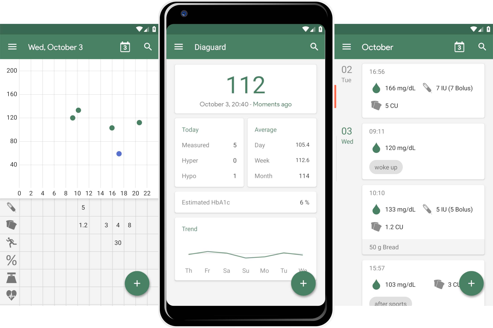
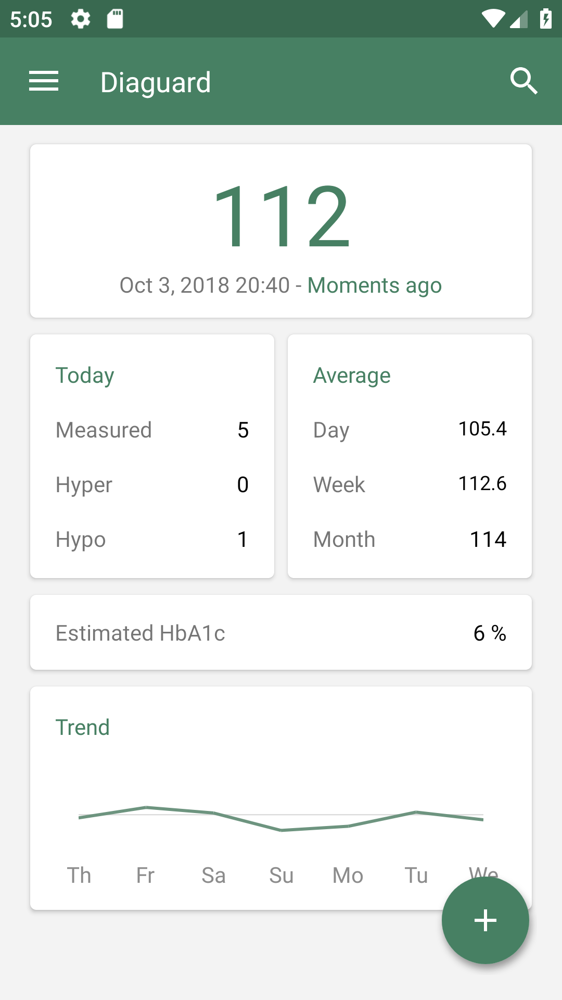
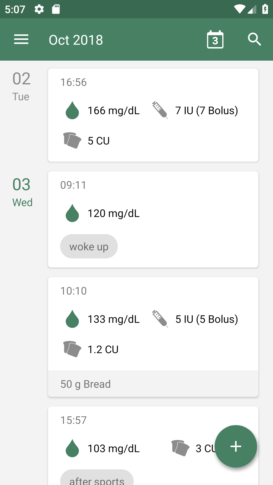
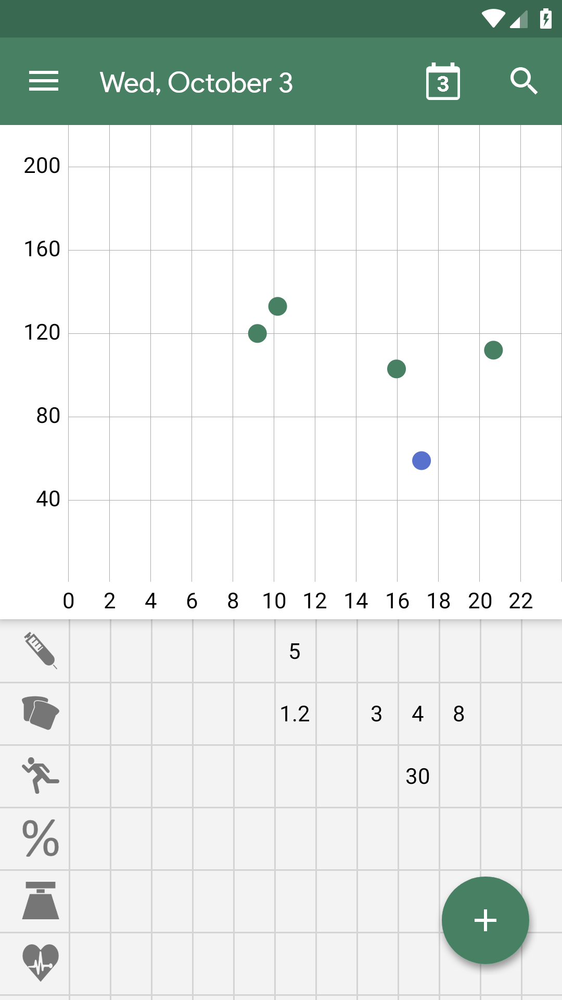
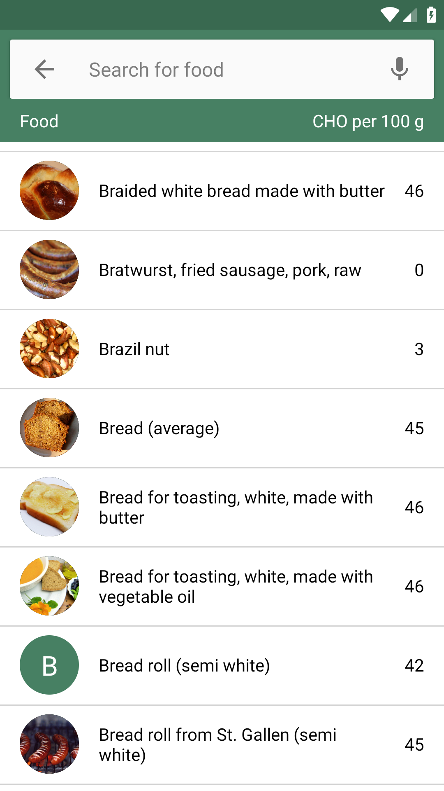
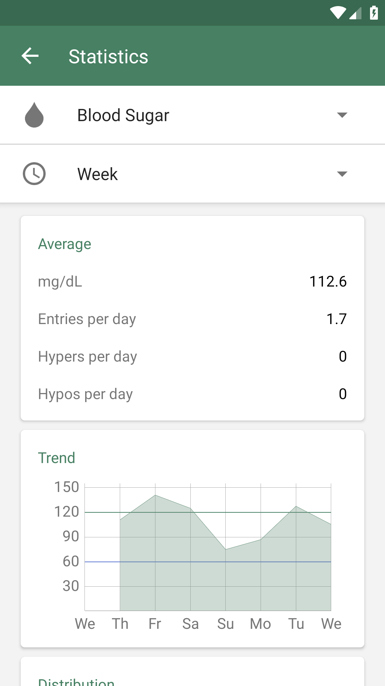
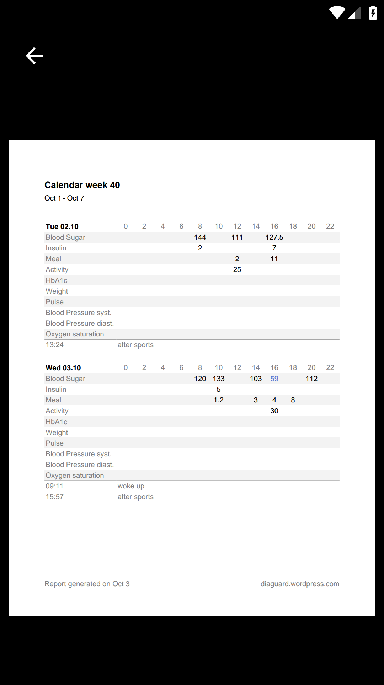

# Diaguard

 

 

Diaguard is an Android app for people with diabetes mellitus.

It replaces the handwritten diary and helps the user to quickly and easily record, evaluate and export his blood sugar and other important data as PDF or CSV. Thanks to the clearly arranged interface, the user always has an overview of his diabetes. The app also provides information on several thousand foods including carbohydrates and other nutrients.

* Quickly and easily track your blood glucose, insulin, carbohydrates, A1c, activity, weight, pulse, blood pressure and oxygen saturation
* Customizable units
* Visualize your blood glucose level in a graph
* Detailed logs of your data
* Food database with thousands of entries
* PDF and CSV export
* Backup
* Reminder functionality
* Estimated HbA1c
* Statistics
* Dark Mode

        

## Distribution

## About

#### History

Development of Diaguard started in October 2013. It was as one of several small projects of one developer who was trying to gain traction on the Android platform. This project soon evolved into a vision named Diaguard which saw its initial release in July 2014. Since then it has received many updates, much appreciated feedback from its users and a little bit of marketing with the help of direct contact and mouth to mouth propaganda. But at the end of the day every line of code has been provided by one sole developer in his spare-time. This should change in April 2020 when the decision was made to go open source.

#### Goals

Diaguard should help diabetics with monitoring their diabetes. It should be able to replace the handwritten diary completely and to supplement tasks like basal rate tests or carb counting. It should help diabetologists with monitoring their patients regularly and when preparing a health insurance application. 

Diaguard's users should always be and feel in full control. All user-generated data must stay on the same device until the user explicitely decides to transfer something to another device, e.g. during an export or backup. Nothing is shared with remote services and network is only used to read data from a food database. User data must not be lost. Therefor database migrations enable user data to be carried from version 1.0 to any existing and upcoming release.

Diaguard should be accessible to most people. Therefor its design is heavily influenced by the [Material Design Guidelines](https://material.io/design) and tested with accessibility tools like [TalkBack](https://play.google.com/store/apps/details?id=com.google.android.marvin.talkback) and [Accessibility Scanner](https://play.google.com/store/apps/details?id=com.google.android.apps.accessibility.auditor).

Diaguard should only be used under the supervision of a diabetologist. 
Diaguard should not be used by minors without the supervision of a parent or legal guardian. 
Diaguard is not a medical app and serves no therapeutical purpose.

#### Business model

There is none. 

Diaguard exists for three reasons: for learning, for fun and for saying thank you. This app kickstarted the career of a professional software developer by leading through the whole software lifecycle: creating a concept, building software from scratch, publishing it to the masses and maintaining a legacy project with additions sprinkled here and there. Additionally it was and is pure fun to enhance this app and to see feedback from a helpful and thankful community. Last but not least Diaguard is a way of giving something back.

For these reasons, Diaguard has been, is and will always be free of cost.

If you want to buy me a beer or support me in general, please use the donate button and be aware of my thanks.

## Development

#### Languages

English is used as general language for naming things. Everything except the content of [String resources](https://developer.android.com/guide/topics/resources/string-resource) should be in English.

[Java](https://java.com/de) is used as programming language. Currently there are no plans to migrate to [Kotlin](https://kotlinlang.org) to prevent a multi-language project. A possible approach could be splitting up the monolith into multiple modules which unleashes the potential to switch language while staying consistent within a module.

[SQLite](https://developer.android.com/training/data-storage/sqlite) is used as query language for the database. Object-relational mapping takes then place via [ORMLite](http://ormlite.com).

[XML](https://developer.android.com/guide/topics/ui/declaring-layout) is used as markup language for user interfaces. These views are then bound to Java via [Butter Knife](http://jakewharton.github.io/butterknife).

#### Architecture

There are two architectural design patterns that are being used for Diaguard: [Model-View-Controller](https://en.wikipedia.org/wiki/Model%e2%80%93view%e2%80%93controller) and [Domain-driven design](https://en.wikipedia.org/wiki/Domain-driven_design).

Model-View-Controller (MVC) was a widely spread design pattern in the early days of Android development until Google presented its Architecture Components in 2017 and Model-View-ViewModel (MVVM) took over. A gradual transition to MVVM is planned due to its advantages over MVC, e.g. regarding encapsulation and testability. 

Domain-driven design improves the structure by grouping files in features. Every feature describes one aspect of the project and should be self-contained to improve focus during development. The only exception to this rule is the shared package which contains everything that is used in multiple features (e.g. database- or networking logic).
 
#### Testing

Testing takes place via [JUnit](https://junit.org), [Espresso](https://developer.android.com/training/testing/espresso) and [Robolectric](http://robolectric.org). Tests are few in number and far from perfect, since most of Diaguard has been developed in the early of days of one developer. However the decision to go open source came with a code of conduct, and instrumentation testing major features was the first step in a right direction. The goal now is to unit- and instrumentation test every new and edited feature in order to increase the quality with every commit.

#### Third-party licenses

This software uses following technologies with great appreciation:

* [AboutLibraries](https://github.com/mikepenz/AboutLibraries)
* [AndroidX](https://developer.android.com/jetpack/androidx)
* [Apache Commons Text](http://commons.apache.org/proper/commons-text)
* [BetterPickers](https://github.com/code-troopers/android-betterpickers)
* [Butter Knife](http://jakewharton.github.io/butterknife)
* [EventBus](https://github.com/greenrobot/EventBus)
* [FloatingActionButton](https://github.com/Clans/FloatingActionButton)
* [Gson](https://github.com/google/gson)
* [Joda-Time](http://www.joda.org/joda-time)
* [joda-time-android](https://github.com/dlew/joda-time-android)
* [JUnit](https://junit.org)
* [Material Components for Android](https://material.io/components)
* [MPAndroidChart](https://github.com/PhilJay/MPAndroidChart)
* [Opencsv](http://opencsv.sf.net)
* [Open Food Facts](http://world.openfoodfacts.org)
* [ORMLite](http://ormlite.com)
* [ORMLite Android](https://github.com/j256/ormlite-android)
* [Parallax Everywhere](https://github.com/Narfss/ParallaxEverywhere)
* [PDFjet](http://pdfjet.com)
* [Picasso](http://square.github.io/picasso)
* [Retrofit](https://square.github.io/retrofit)
* [Robolectric](http://robolectric.org)
* [Schweizer Nährwertdatenbank](http://naehrwertdaten.ch)

These dependencies are bundled with Diaguard but under the terms of their respective license.

## Legal

#### Redistribution

Additionally to the permissions, conditions and limitations of the GPLv3, the permission for redistribution must be manually requested in advance. This ensures that neither the original software or any fork will be affected negatively by terms and conditions like the [Google Play Developer Distribution Agreement](https://play.google.com/about/developer-distribution-agreement.html). If you plan to redistribute this software, please contact the maintainer at [diaguard.de@gmail.com](mailto:diaguard.de@gmail.com).

#### License

    Copyright (C) 2013-2020 Philipp Fahlteich

    This program is free software: you can redistribute it and/or modify
    it under the terms of the GNU General Public License as published by
    the Free Software Foundation, either version 3 of the License, or
    (at your option) any later version.

    This program is distributed in the hope that it will be useful,
    but WITHOUT ANY WARRANTY; without even the implied warranty of
    MERCHANTABILITY or FITNESS FOR A PARTICULAR PURPOSE.  See the
    GNU General Public License for more details.

    You should have received a copy of the GNU General Public License
    along with this program.  If not, see <https://www.gnu.org/licenses/>.

